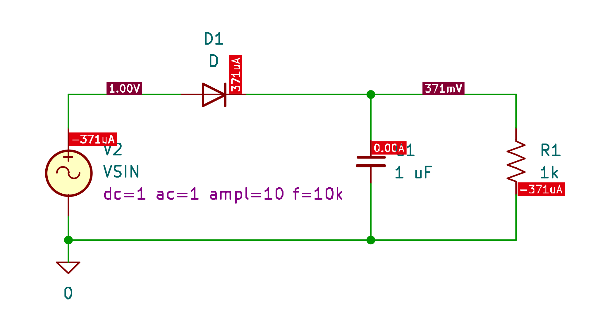
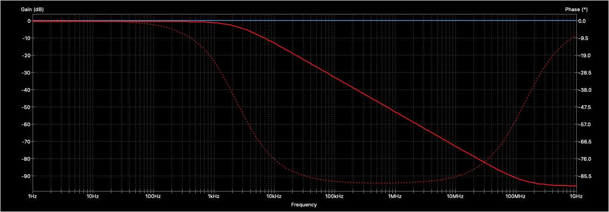
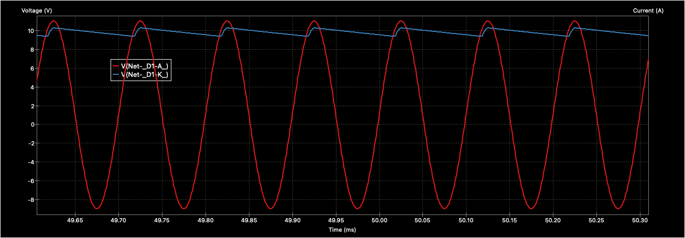

# KiCad SPICE Hello World

A simple demonstration of SPICE simulation capabilities in KiCad, featuring a half-wave rectifier circuit.

## Circuit Schematic

## Circuit Description

This project demonstrates a basic half-wave rectifier with filtering:
- Sinusoidal voltage source (1V, 1kHz)
- Diode for rectification
- 0.1μF capacitor for filtering
- 1kΩ resistor as load

## Simulation Types

The project includes three preconfigured simulations:

1. **Operating Point Analysis**
   - Commands: `.op`, `.save all`, `.probe alli`, `.probe allp`
   - DC voltage and current values at each node

2. **AC Analysis**
   - Commands: `.ac dec 20 1 1G` (Frequency sweep from 1Hz to 1GHz)
   - Voltage gain and phase plots

   

3. **Transient Analysis**
   - Commands: `.tran 1u 100m` (1μs step size over 100ms)
   - Input and output voltage waveform comparison
   
   

## Getting Started

1. Open the project in KiCad
2. Open the schematic file
3. Launch the simulator
4. Select and run one of the simulation types

## Requirements

- KiCad 9.0 or later with integrated SPICE simulation